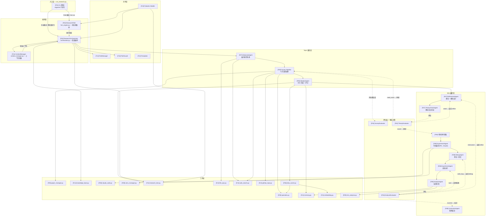

# 运行流程

## 全局流程图



## 入口与初始化

### 程序启动

`python run_research.py <command> [options]`（`run_research.py:653-800`）

1. **环境加载** — `_load_dotenv()`（行 36-47）读取 `.env` 文件，设置 `MINIMAX_API_KEY`、`ZHIPU_API_KEY` 等环境变量
2. **日志配置** — `logging.basicConfig` + 静音 httpx/anthropic 等库（行 49-56）
3. **CLI 解析** — `argparse` 定义 15 个子命令：init, elaborate, survey, ideation, refine, code-ref, code, theory-check, debug, experiment, analyze, conclude, status, memory, auto, fsm
4. **命令派发** — `commands[args.command](args)` 映射到对应 `cmd_*` 函数

### 两种运行模式

**手动模式**：用户逐阶段执行 `python run_research.py elaborate`、`survey`、`ideation` 等

**FSM 模式**：`python run_research.py fsm run [--topic T001] [--idea T001-I001]`
- Topic 级：自动走 elaborate → survey → ideation
- Idea 级：自动走 refine → theory_check → code_reference → code → debug → experiment → analyze → conclude
- 支持 `--force <state>` 强制跳转和 `--from <state>` 指定起始状态

### Orchestrator 初始化

`_get_orchestrator(args)` → `ResearchOrchestrator.__init__`（`orchestrator.py:40-84`）

- 创建 `PathManager(project_root, topic_dir)` — 统一路径解析
- 创建 `ResearchTreeService(paths)` — 研究树 CRUD
- 创建 `KnowledgeBaseManager(zhipu_api_key)` — 知识库管理（可选）
- 创建 `ContextManager(paths, kb_mgr)` — 上下文组装
- 加载 `TopicConfig` — Pydantic 校验配置

## 主流程阶段详解

### 阶段 1：Init — 项目初始化
- **涉及功能**：F01
- **触发条件**：`python run_research.py init --topic mean_reversion.md`
- **输入数据**：`topics/` 下的 markdown 文件（含标题、领域、关键词、描述、范围）
- **处理逻辑**：
  1. 创建全局目录结构（knowledge/, memory/, topics/）
  2. 解析 topic markdown → `_parse_topic_md()` 提取结构化信息
  3. 分配 topic ID（T001 递增）
  4. 创建 topic 子目录（survey/papers/, ideas/, phase_logs/）
  5. 复制原始 md 为 `topic_spec.md`
  6. 生成 `config.yaml`（LLM 配置、环境配置、搜索配置）
  7. 创建 `research_tree.yaml`（Pydantic → YAML）
- **输出数据**：`topics/T001_topic_name/` 目录结构 + config.yaml + research_tree.yaml
- **关键分支**：无 --topic 参数时只创建全局目录并打印模板

### 阶段 2：Elaborate — 研究背景展开
- **涉及功能**：F07, F01, F11
- **触发条件**：`elaborate` 命令 或 FSM topic_state == "elaborate"
- **输入数据**：`topic_spec.md`、可选的 ref_topics 上下文
- **处理逻辑**：
  1. `ContextManager.build_context("elaborate")` 组装上下文
  2. 创建 `ElaborateAgent`（3 个工具：read_file, write_file, web_search，12 次迭代上限）
  3. Agent ReAct 循环：读 spec → web 搜索补充 → 写 `context.md`
  4. 上传产物到知识库（如启用）
- **输出数据**：`topics/T001_*/context.md`（≥2000 字符：背景+问题空间+具体问题+范围边界）
- **错误处理**：Agent 达到迭代上限时返回当前最佳结果

### 阶段 3：Survey — 5 步文献调研
- **涉及功能**：F05, F11
- **触发条件**：`survey` 命令 或 FSM topic_state == "survey"
- **输入数据**：context.md、config.yaml（关键词）、已有 paper_list.yaml（多轮时）
- **处理逻辑**：
  1. **Step 1 — 论文搜索**：`make_search_agent()` 创建搜索 Agent（9 个工具），执行 4 阶段搜索策略（经典文献 → 前沿论文 → 引用图扩展 → 写 paper_list.yaml）
  2. **Step 2+3 — 下载 + 摘要**：遍历 paper_list.yaml，`download_paper()` 下载 PDF → Zhipu/MinerU 解析 → `summarize_single_paper()` 单次 LLM 调用生成摘要
  3. **Step 4 — Repo 研究**：`make_repo_agent()` 搜索相关代码仓库 → `clone_repo()` + `summarize_repo()`
  4. **Step 4a — EDA Guide**：Agent 生成数据探索指南 `eda_guide.md`
  5. **Step 4b — Data EDA**：`DataAgent`（8 个工具，35 次迭代）下载数据 → 编写 EDA 脚本 → VLM 分析图表 → 写 eda_report.md
  6. **Step 5 — 综合**：Agent 综合所有摘要 → 写 `survey.md`（综述）+ `baselines.md` + `datasets.md` + `metrics.md` + `leaderboard.md`
- **输出数据**：survey/ 目录下完整文献调研产物
- **关键分支**：`SurveyEvaluator` 评估覆盖度 → sufficient（继续 ideation）/ need_more（再来一轮，round+1）

### 阶段 4：Ideation — Idea 生成
- **涉及功能**：F06
- **触发条件**：`ideation` 命令 或 FSM topic_state == "ideation"
- **输入数据**：context.md, survey.md, baselines.md, datasets.md, metrics.md, failed_ideas.md
- **处理逻辑**：
  1. 创建 `IdeationAgent`（10 个工具，20 次迭代）
  2. Agent ReAct 循环：阅读调研材料 → 搜索验证 → 写 `ideas/*/proposal.md` → `add_idea_to_tree()` 注册 → `add_idea_relationship()` 记录关系
  3. `score_all_ideas()`：对每个 idea 执行评分流水线
     - `extract_search_queries()` → LLM 提取搜索查询
     - `search_prior_work()` → OpenAlex 查重
     - `compute_max_similarity()` → embedding 相似度检测（≥0.85 标记为抄袭）
     - `score_idea()` → LLM 4 维评分（Novelty×0.35 + Significance×0.35 + Feasibility×0.20 + Alignment×0.10）
  4. 排名 + 写 `review.md` → 更新研究树 scores + status
- **输出数据**：`ideas/IXXX_shortname/proposal.md` + `review.md`、研究树更新
- **关键分支**：评分≥3.5 → recommended；<3.5 → deprioritized

### 阶段 5：Refine — 理论深化与模块设计
- **涉及功能**：F07
- **触发条件**：`refine --idea T001-I001` 或 FSM idea_state == "refine"
- **输入数据**：proposal.md, survey.md, baselines.md, 上轮 feedback（如有）
- **处理逻辑**：
  1. 创建 `RefinementAgent`（7 个工具，20 次迭代）
  2. Agent 输出 4 个文档到 `ideas/*/refinement/`：
     - `theory.md`（≥2000 字符：数学公式 + 理论推导）
     - `model_modular.md`（≥1500 字符：模块拆分 + 接口定义）
     - `model_complete.md`（≥3000 字符：端到端设计）
     - `experiment_plan.md`（≥1000 字符：分阶段实验计划）
- **输出数据**：`refinement/` 目录下 4 个设计文档
- **关键分支**：FSM 评估 → 进入 theory_check

### 阶段 6：Theory Check — 理论交叉验证
- **涉及功能**：F07, F04
- **触发条件**：FSM idea_state == "theory_check"（refine 之后）
- **输入数据**：theory.md, survey.md, proposal.md
- **处理逻辑**：
  1. 创建 `TheoryCheckAgent`（6 个工具，15 次迭代）
  2. Agent 提取关键声明 → 文献交叉验证 → 写 `theory_review.md`
  3. `TheoryEvaluator` 评估理论质量
- **输出数据**：`refinement/theory_review.md`
- **关键分支**：
  - `sound` → 继续 code_reference（retry_counts 清零）
  - `weak` → 返回 refine（附带 feedback，retry_count+1，最大 3 次）
  - `flawed` → 返回 refine 或 abandon

### 阶段 7：Code Reference — 代码参考获取
- **涉及功能**：F08, F05
- **触发条件**：FSM idea_state == "code_reference"
- **输入数据**：refinement/ 文档、repos_summary.md
- **处理逻辑**：
  1. `make_repo_agent()` 搜索相关代码仓库
  2. `clone_repo()` 浅克隆 → `summarize_repo()` Claude 生成代码摘要
  3. Agent 写 `code_reference.md`（参考代码关键实现）
- **输出数据**：`ideas/*/code_reference.md`

### 阶段 8：Code — 代码编写
- **涉及功能**：F08
- **触发条件**：`code --idea T001-I001` 或 FSM idea_state == "code"
- **输入数据**：refinement/ 文档、code_reference.md、experiment_infrastructure.md 模板
- **处理逻辑**：
  1. 创建 `ExperimentAgent`（11 个工具，40 次迭代）
  2. Agent 作为 PM，将代码任务分解为独立模块
  3. 对每个模块调用 `claude_write_module()` → `claude -p` 子进程实现
  4. Agent 生成 `src/structure.md` + `src/requirements.txt`
  5. `setup_venv()` 创建隔离虚拟环境
- **输出数据**：`ideas/*/src/` 目录（完整实验代码，遵循 8 项基础设施规范）
- **关键分支**：FSM → 进入 debug

### 阶段 9：Debug — 测试与修复
- **涉及功能**：F08, F04
- **触发条件**：FSM idea_state == "debug"
- **输入数据**：src/ 目录、structure.md、experiment_plan.md
- **处理逻辑**：
  1. 创建 `DebugAgent`（6 个工具，35 次迭代，最多 5 轮修复）
  2. Agent 运行测试 → 定位 bug → `claude_fix_error()` 修复 → 验证
  3. 写 `src/debug_report.md`
  4. FSM 解析 debug_report 提取 verdict
- **输出数据**：修复后的 src/ + debug_report.md
- **关键分支**：
  - `tests_pass` → 继续 experiment
  - `fixable` → 重试 debug（retry_count+1，最大 6 次）
  - `needs_rewrite` → 返回 code
  - `design_issue` → 返回 refine

### 阶段 10：Experiment — 实验运行
- **涉及功能**：F08
- **触发条件**：`experiment --idea T001-I001` 或 FSM idea_state == "experiment"
- **输入数据**：src/ 代码、config 文件、venv 环境
- **处理逻辑**：
  1. 创建 `ExperimentAgent`（11 个工具，40 次迭代）
  2. Agent 在 venv 中执行实验步骤（S01_quick_test → S02_small_scale → ...）
  3. 每个步骤支持多版本迭代（V1, V2, V3...）
  4. 收集实验结果到 `results/SXX_name/VN/`
- **输出数据**：`results/` 目录（实验结果、日志、模型检查点、可视化）
- **关键分支**：实验步骤完成 → 进入 analyze

### 阶段 11：Analyze — 结果分析
- **涉及功能**：F09, F04
- **触发条件**：`analyze --idea T001-I001` 或 FSM idea_state == "analyze"
- **输入数据**：results/ 实验结果、experiment_plan.md（预期指标）、baselines.md
- **处理逻辑**：
  1. 创建 `AnalysisAgent`（7 个工具，20 次迭代）
  2. Agent 逐步骤逐版本分析：与 baseline 比较、与预期比较
  3. `analyze_plots_dir()` → VLM 分析实验图表
  4. 写 `analysis.md`（≥1500 字符，含具体数值）
  5. `AnalysisEvaluator` 结构化评估
- **输出数据**：`results/*/analysis.md`
- **关键分支**（AnalysisEvaluator 判定）：
  - `success` → 进入 conclude
  - `tune` → 返回 experiment（调参，version+1）
  - `enrich` → 返回 experiment（加特征）
  - `restructure` → 返回 refine（重设计）
  - `code_bug` → 返回 debug
  - `abandon` → 放弃此 idea

### 阶段 12：Conclude — 客观总结
- **涉及功能**：F09
- **触发条件**：`conclude --idea T001-I001` 或 FSM idea_state == "conclude"
- **输入数据**：整条链路产物：proposal → refinement → src → results → analysis
- **处理逻辑**：
  1. 创建 `ConclusionAgent`（5 个工具，15 次迭代）
  2. Agent 读取全链路 → 写 `conclusion.md`（≥2000 字符，6 个必含节）
  3. 记录经验到 `memory/experience_log.yaml`
- **输出数据**：`ideas/*/conclusion.md`
- **关键分支**：无（idea 完成）

## 状态管理与持久化

### FSM 状态持久化

文件：`topics/T001_*/fsm_state.yaml`（`FSMSnapshot` Pydantic 模型）

```yaml
topic_state: "ideation"          # Topic 级当前状态
idea_states:
  I001:
    current_state: "experiment"  # Idea 级当前状态
    step_id: "S01"               # 当前实验步骤
    version: 2                   # 当前版本号
    retry_counts:                # 每状态重试计数
      refine: 1
      debug: 2
    feedback: "tune parameters"  # 上轮评估反馈
transition_history:              # 状态转换历史
  - timestamp: "2026-03-20T10:30:00"
    from_state: "analyze"
    to_state: "experiment"
    trigger: "eval:tune"
    idea_id: "I001"
    feedback: "MSE still 15% above baseline"
```

### 研究树持久化

文件：`topics/T001_*/research_tree.yaml`（`ResearchTree` Pydantic 模型）

追踪：topic 元信息、elaborate/survey 状态、所有 idea（状态、评分、阶段进度、实验步骤、迭代版本、idea 间关系）

### 重试与死循环防护

每个 FSM 状态有最大重试次数：
- refine: 4, theory_check: 3, debug: 6, experiment: 6, survey: 4
- 达到上限时暂停并提示用户干预

## 数据流总览

```
topics/*.md（课题定义）
    ↓ init
topics/T001_*/config.yaml + research_tree.yaml
    ↓ elaborate
topics/T001_*/context.md（研究背景）
    ↓ survey (5步)
survey/paper_list.yaml → papers/pdf → papers/parsed → papers/summaries
survey.md + baselines.md + datasets.md + metrics.md + leaderboard.md
knowledge/repos/ (克隆的代码仓库)
knowledge/eda/ (数据探索报告)
    ↓ ideation
ideas/I001_shortname/proposal.md + review.md
idea_graph.yaml（idea 关系图）
    ↓ refine
ideas/I001_*/refinement/theory.md + model_modular.md + model_complete.md + experiment_plan.md
    ↓ theory_check
ideas/I001_*/refinement/theory_review.md
    ↓ code_reference
ideas/I001_*/code_reference.md
    ↓ code
ideas/I001_*/src/（完整实验代码）+ structure.md + requirements.txt
    ↓ debug
ideas/I001_*/src/debug_report.md
    ↓ experiment
ideas/I001_*/results/S01_quick_test/V1/（实验结果）
    ↓ analyze
ideas/I001_*/results/*/analysis.md
    ↓ conclude
ideas/I001_*/conclusion.md
```

### 关键数据模型

| 模型 | 定义位置 | 用途 |
|------|----------|------|
| `TopicConfig` | `shared/models/config.py:44` | 配置校验（LLM、环境、数据集、指标） |
| `ResearchTree` | `shared/models/research_tree.py:99` | 研究层级追踪 |
| `FSMSnapshot` | `shared/models/fsm.py:124` | FSM 运行时状态持久化 |
| `Score` | `shared/models/research_tree.py:10` | Idea 4 维评分（加权复合分） |
| `IdeaPhases` | `shared/models/research_tree.py:27` | 8 个阶段的状态追踪 |
| `ExperimentStep` / `Iteration` | `shared/models/research_tree.py:46,39` | 实验步骤 + 版本迭代 |
| `AnalysisDecision` | `shared/models/fsm.py:62` | 分析评估结构化输出 |
| `TheoryDecision` | `shared/models/fsm.py:77` | 理论评估结构化输出 |
| `Paper` / `PaperIndexEntry` | `shared/models/paper.py:17,31` | 论文元数据标准化 |
| `ExperienceEntry` | `shared/models/memory.py:10` | 经验日志条目 |
